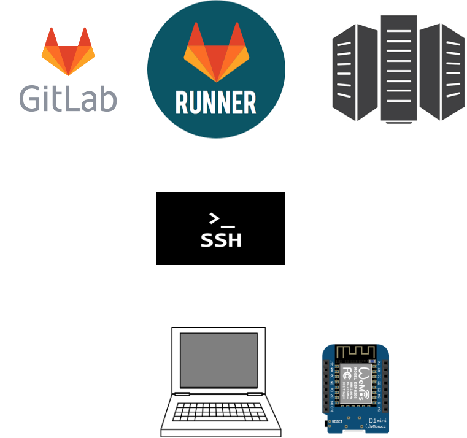

Arduino-cli blink example for ESP2866 + gitlab-ci + kubernetes
==============================================================

The goal here is to blink a LED on an ESP8266 (wemos d1 mini) using:

* arduino-cli
* gitlab-ci
* Raspberry-pi board -> my laptop
* kubernetes -> docker

Standalone arduino-cli
======================

```
$ arduino-cli board listall
$ arduino-cli sketch new blink2
$ cp -v blink2.ino ~/Arduino/blink2/
$ arduino-cli compile --fqbn esp8266:esp8266:d1 Arduino/blink2
$ arduino-cli upload -p /dev/ttyUSB0 --fqbn esp8266:esp8266:d1 Arduino/blink2
```

Gitlab-ci architecture
======================

```
Gitlab -> Gitlab-Runner -> Gitlab-Registry -> SSH-Tunnel -> Laptop -> ESP8266
```




Expose SSHD to the outside world
================================

```
dockeru@sabayon$ while true; do ssh -R zoobab:18022:localhost:22 serveo.net ; done
```

Problems
========

* docker+ssh instead of k3s/k8s
* gitlab vs github dockerhub support
* multistage build:
1. arduino-cli
2. arduino-cli+esp8266sdk
3. arduino-cli+esp8266+yourcode
* Kubernetes Kind containers can see /dev/ttyUSB0
* Try ser2net (exposed on a static URL on k8s)
* Try ser2net TCP port exposure without kubernetes? Unsecure?

Ideas
=====

* WebIDE with webusb direct communication to the USB device? Like the Dapboot project https://github.com/devanlai/dapboot
* Arduino-IDE git support
* docker run with your ino code as argument
* replace the Raspbery with a second esp with Jeelink firmware to bridge the serial port to a box in the cloud: http://www.zoobab.com/esp8266-serial2wifi-bridge
* standard k8s on rpi
* compile for both arches at the same time (laptop in amd64, rpi in armv7)
* qemu-arm-static wrapper so that the tools are in armv7

Links
=====

* Fosdem 2019 talk: https://fosdem.org/2019/schedule/event/hw_gitlab_ci_arduino/
* Arduino CLI: https://github.com/arduino/arduino-cli
* K3S Kubernetes stripped: https://github.com/ibuildthecloud/k3s
